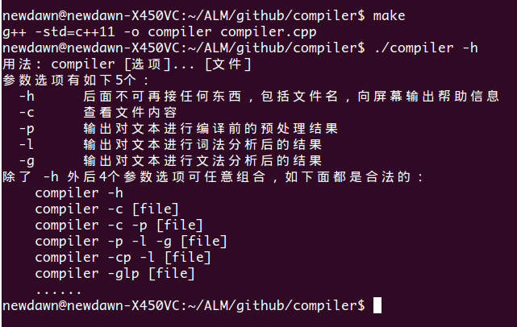
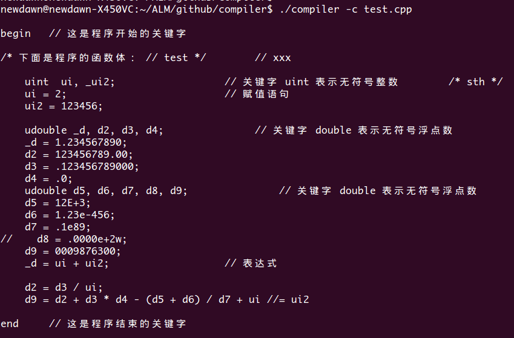
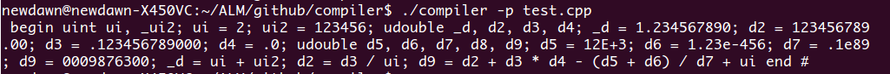
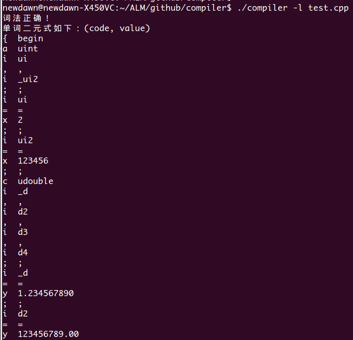
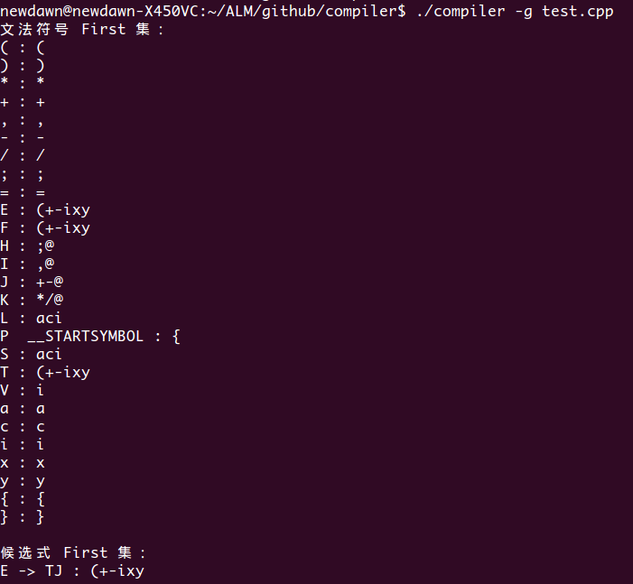
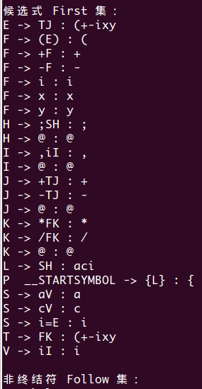
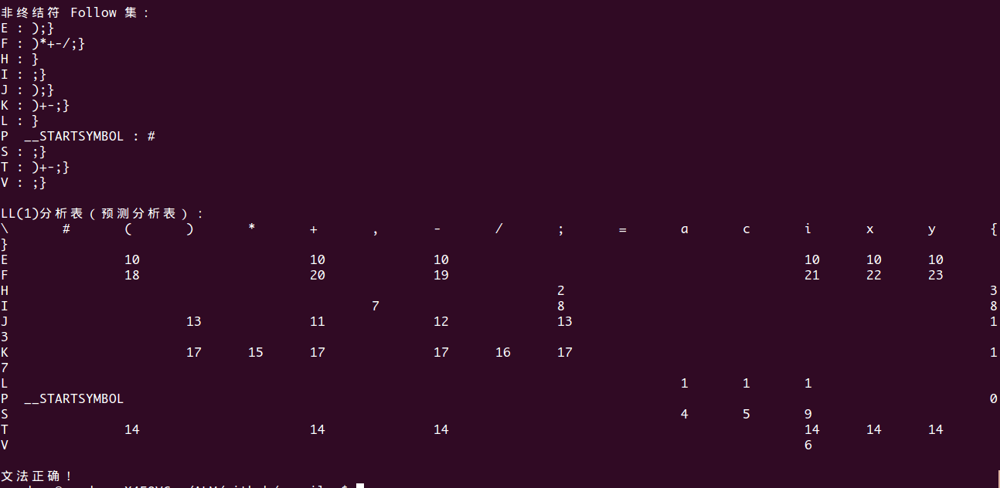

#compiler
一个小型编译器的前端部分，包含**词法分析**和**文法分析** 
词法分析使用的是经典的nfa转dfa算法 
文法分析使用的是LL(1)文法 
使用的是标准C++，没有用到任何外部库，因此在linux和windows下都可进行编译。 
运行结果截图：  
**编译和获取帮助信息：**
 
**查看文件内容：**
 
**预处理程序：**
 
**对程序进行词法分析后的结果：（部分截图）**
 
**文法分析的LL(1)各种表信息：**
 
 
  
输出格式可能稍微有点乱，已经尽可能调整过的了～
